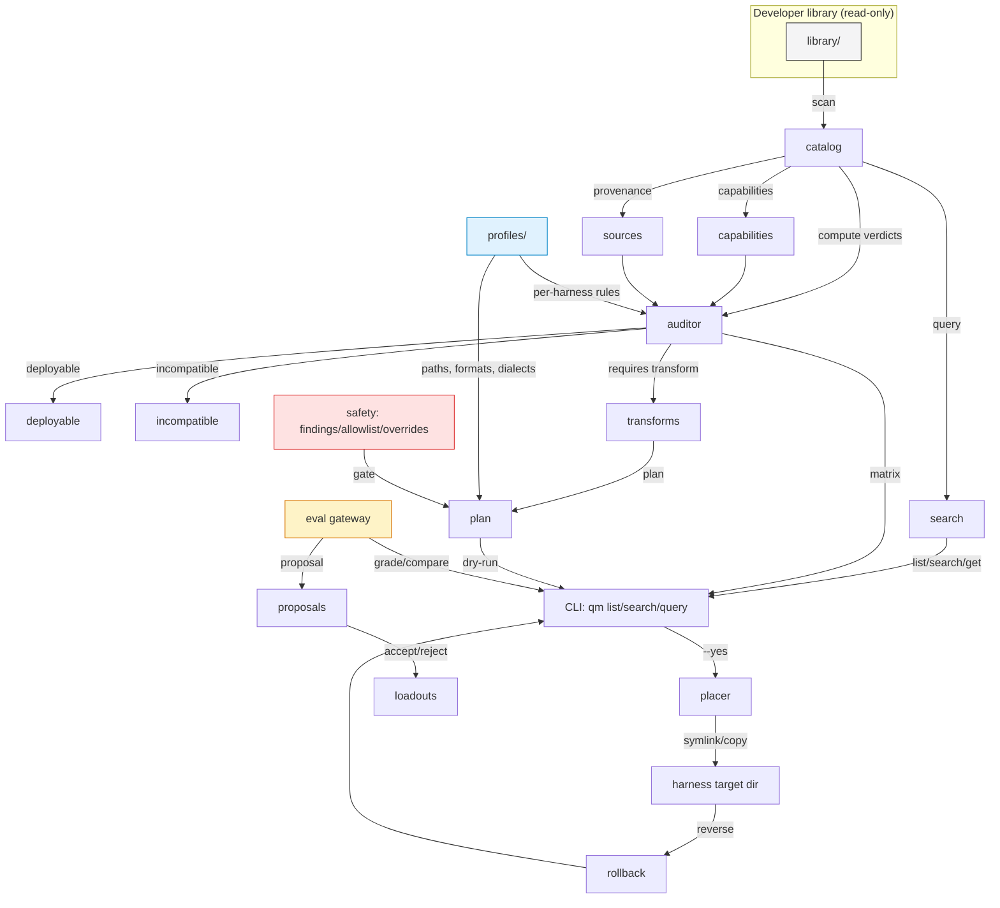
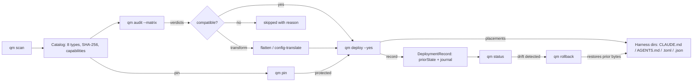

# Quartermaster

> **keeper of the helm** -- one local library, every agentic CLI.

**Build** `145 pass / 0 fail` **Test** **146 pass / 0 fail** **License** **MIT**

Quartermaster lives on your machine as a **local-first, deterministic engine** that scans a developer-controlled library of agent artifacts (skills, plugins, hooks, agents, commands, MCP configs, output styles, and scripts), computes compatibility verdicts against named harness profiles, and deploys the right shape into each harness's expected layout -- without ever mutating the library.

```
library ──► catalog ──► audit ──► plan ──► deploy ──► status
                ▲          ▲                  ▲
             scan        eval            rollback
```

## Table of Contents

- [What it does](#what-it-does)
- [How it works](#how-it-works)
- [Live surfaces](#live-surfaces)
- [Installation](#installation)
- [Quick start](#quick-start)
- [Commands](#commands)
- [Config reference](#config-reference)
- [Harness profiles](#harness-profiles)
- [Advisory layer](#advisory-layer)
- [Optional modules](#optional-modules)
- [Development](#development)
- [License](#license)

## What it does

Agentic tools (Claude Code, Codex, Antigravity, OpenCode, Pi, Hermes, …) each expect different directory layouts, filename conventions, and config formats. A skill that works for Claude Code needs flattening for Codex, an AGENTS.md rewrite for Antigravity, and a TOML config translation for OpenCode -- and every harness has its own rules for hooks, MCP configs, and plugin placement.

Quartermaster solves this with **declarative harness profiles** instead of hardcoded branches:

1. **Catalog** -- scans library roots once, identifies all 8 artifact types, records provenance and runtime capabilities. Incremental rescans skip unchanged entries.
2. **Audit** -- computes a compatibility verdict per (artifact × harness) pair: *deployable*, *incompatible*, or *transform-required* (with the transform named, e.g. `flatten` or `config-translate`).
3. **Deploy** -- compiles a dry-run plan, applies copy or symlink placements, writes per-harness guidance files with delimited managed sections, and records every change for reverse rollback.
4. **Status** -- reports what's deployed, what's drifted out of sync, and what's orphaned.

Everything that writes to disk is reversible. The eval layer (grade, compare, investigate) is strictly advisory -- proposals require explicit accept before any state mutation.

## How it works



### Data flow: a full cycle



### Compatibility matrix overview

```mermaid
quadrantChart
    title Compatibility: deployable vs. incompatible vs. transform-required
    x-axis Unsupported --> Fully Supported
    y-axis Config/Format Mismatch --> Capability Match
    quadrant-1 Deployable
    quadrant-2 Transform (flatten / config-translate)
    quadrant-3 Incompatible (type/capability missing)
    quadrant-4 Advisory (human review before apply)
```

## Live surfaces

Quartermaster ships **three read-only-to-write surfaces** over the same engine. The CLI is the primary surface; TUI and Web are read-only dashboards.

| Surface | Entry point | Read | Write |
|---------|------------|------|-------|
| CLI     | `qm`        | full | deploy, rollback, config set, loadout assign, pin, safety override, proposal accept/reject/edit |
| TUI     | `qm tui`    | catalog browse, matrix, loadouts, proposals | -- |
| Web     | `qm web`    | same as TUI + POST/accept | proposal accept |

The optional **MCP server** (`qm mcp serve`, opt-in via `QM_MCP_ENABLED=true`) exposes the same query ops (`list-skills`, `search`, `get`, `audit`, `scaffold`) as JSON-RPC 2.0 tools. It is disabled by default; the CLI remains primary in all cases.

## Installation

### One-liner (macOS, Linux, WSL2)

```bash
curl -fsSL https://raw.githubusercontent.com/aaaronmiller/001-quartermaster/main/install.sh | bash
```

Or clone and install manually:

```bash
git clone https://github.com/aaaronmiller/001-quartermaster.git
cd 001-quartermaster
./install.sh
```

The installer checks for **Bun 1.3+**, installs it if missing, runs `bun install`, builds the CLI, symlinks the binary to `~/.local/bin/`, and guarantees the PATH is set in your current shell RC file.

### Requirements

| Runtime | Version | Why |
|---------|---------|-----|
| **Bun** | ≥ 1.3.0 | Single-runtime: compile, test, and serve |
| bash / zsh | any | Installer + shell integration |
| git | any | Import from git repos, record provenance |

No Node.js, no Python, no Docker.

### Verified on

- macOS -- arm64 (Apple Silicon), x64 (Intel)
- Linux -- x64, arm64 (Debian / Ubuntu, WSL2)
- Windows -- WSL2 Ubuntu (same builds as Linux)

## Quick start

```bash
# 1. Add eval credentials (optional; skips advisory features until set)
export QM_EVAL_API_KEY=sk-...

# 2. Scan your artifact library
qm scan ~/.quartermaster/library --json

# 3. List what's there
qm list

# 4. Configure a harness (e.g. Claude Code)
qm config set harnesses '["claude-code"]' --json

# 5. See the compatibility matrix
qm audit --matrix --json

# 6. Dry-run deploy
qm deploy claude-code --json

# 7. Apply
qm deploy claude-code --yes --json

# 8. Check what's deployed and whether anything drifted
qm status claude-code --json

# 9. Reverse a bad deploy
qm rollback <deployId> --json
```

Full quickstart walkthrough: `specs/001-quartermaster/quickstart.md`

## Commands

Every command supports `--json` for machine-readable output and exits nonzero with a plain-language `reason` on failure. Run `qm --help` for the full live list.

### Catalog & ingestion

| Command | Description |
|---------|-------------|
| `qm scan [roots] [--incremental]` | Scan library roots into the catalog (SHA-256, 8 artifact types) |
| `qm list [--type=TYPE] [--capability=CAP] [--source=SRC] [--path=PATH]` | Filter catalog by type, capability, source, or path |
| `qm search <text> [--type=TYPE] ...` | Free-text search across name / path / metadata |
| `qm import <source> [--kind=git] [--kind=git_subdir] [--kind=marketplace] [--kind=local]` | Import from git, git subdir, marketplace, or local path |
| `qm sync [--check] [--confirm]` | Report upstream currency (unchanged / ahead / conflict) |
| `qm pin <id> <rev>` / `qm unpin <id>` | Pin to a revision -- skipped during sync |
| `qm new <type> <path>` | Scaffold a self-authored artifact in a library subfolder |

### Profiles, audit & deploy

| Command | Description |
|---------|-------------|
| `qm profile add/list/edit/validate <id>` | Manage declarative harness profiles (data-driven) |
| `qm audit [--matrix]` | Compatibility verdict per (artifact × harness) |
| `qm audit override <id> <harness> --status <v> --note "<n>"` | Manual verdict override |
| `qm audit risk` | Scan risk indicators (bundled scripts, network, secrets) |
| `qm audit safety <id>` | Run registered safety auditors; persist findings |
| `qm deploy <harness\|--all> [--scope=<selector>] [--yes]` | Dry-run by default; apply with `--yes` |
| `qm rollback <deployId>` | Reverse a recorded deployment |
| `qm status <harness\|--all>` | Deployed artifacts, drift, and orphans |

### Loadouts, pipelines & guidance

| Command | Description |
|---------|-------------|
| `qm loadout create/add/remove/list/assign/copy/status` | Named artifact + pipeline sets |
| `qm loadout add-pipeline <loadout> <pipeline>` | Attach pipeline (skills + directives together) |
| `qm pipeline create/add/delete/list/validate/propose [--instruction]` | Ordered skill pipelines |
| `qm propose loadouts` | Agentic candidate loadout proposals (by inferred use case) |
| `qm guidance render <harness> [--source=<path>]` | Render per-harness guidance with managed sections |

### Advisory evaluation (never auto-applied)

| Command | Description |
|---------|-------------|
| `qm eval config` | Inspect eval gateway config |
| `qm eval grade <id> --categories=c1,c2` | Per-category score + rationale via model |
| `qm eval compare <id>...` | Rank artifacts with trade-off reasons |
| `qm eval investigate <id> [--turns=N]` | Multi-turn investigation (body-level) |
| `qm proposal list/accept/reject/edit <id>` | Review and apply proposals |
| `qm propose loadouts` | Group-by-use-case loadout proposals |

### Safety

| Command | Description |
|---------|-------------|
| `qm safety allowlist add/remove/list <id>` | Trusted sources exempt from repeat auditing |
| `qm safety audit <id>` | Run risk scanner + persist findings |
| `qm safety override <id> --note "<n>"` | Override a safety gate |
| `qm safety threshold <0..1>` | Set the deploy gate threshold |

### Agent surfaces (machine-readable)

| Command | Description |
|---------|-------------|
| `qm query list-skills [--type=TYPE]` | List catalog artifacts |
| `qm query search --capability=<cap>` | Search by runtime capability |
| `qm query get <id>` | Retrieve artifact metadata |
| `qm query audit <id>` | Per-harness audit verdicts |
| `qm query scaffold <type> <path>` | Create an artifact stub |
| `qm query status [<harness>]` | Deployed state |
| `qm mcp status \| serve` | Opt-in JSON-RPC 2.0 MCP server (off by default) |

### Config

| Command | Description |
|---------|-------------|
| `qm config get <key>` | Read current value |
| `qm config set <key> <value>` | Write to local project config (rolls back on invalid) |
| `qm config list` | Full config (redacted secrets) |
| `qm config path` | Show config file paths |

### Surfaces

| Command | Description |
|---------|-------------|
| `qm tui` | Dark-mode-first terminal dashboard |
| `qm web [--port=N]` | Local (127.0.0.1) dark-mode-first web UI |

### Optional

| Command | Description |
|---------|-------------|
| `qm compose validate <chain.json>` | Validate Noun/Verb/Adjective artifact chain |

## Config reference

Quartermaster uses a layered config: **defaults → global → project → env**. Set values override downward using deep-merge.

| Key | Env var | Default | Description |
|-----|---------|---------|-------------|
| `roots` | `QUARTERMASTER_ROOTS` | `~/.quartermaster/library` | Library scan roots |
| `dbPath` | `QUARTERMASTER_DB_PATH` | `~/.quartermaster/catalog.db` | SQLite catalog |
| `profileDir` | `QUARTERMASTER_PROFILE_DIR` | `~/.quartermaster/profiles` | Custom profiles |
| `harnesses` | `QUARTERMASTER_HARNESSES` | `[]` | Active harness names |
| `harnessGroups` | `QUARTERMASTER_HARNESS_GROUPS` | `{}` | Named groups for group deploy |
| `safety.threshold` | `QUARTERMASTER_SAFETY_THRESHOLD` | `0.6` | Deploy gate (0..1) |
| `composition.enabled` | `QM_COMPOSITION_ENABLED` | `false` | Enable composition module |
| `eval.provider` | `QM_EVAL_PROVIDER` | `openai-compatible` | Model provider label |
| `eval.baseUrl` | `QM_EVAL_BASE_URL` | blank | Model endpoint URL |
| `eval.defaultModel` | `QM_EVAL_DEFAULT_MODEL` | blank | Fallback model id |
| `eval.apiKeyEnv` | `QM_EVAL_API_KEY` *(name)* | `QM_EVAL_API_KEY` | Env var holding the API key |
| `eval.turnBudget` | `QM_EVAL_TURN_BUDGET` | `8` | Multi-turn investigation max |
| `mcp.enabled` | `QM_MCP_ENABLED` | `false` | Opt-in MCP server |

> **NFR-031**: API keys are read from env at call time. The config stores only the env-var NAME. `redactSecrets` masks credential fields in any serialized output.

Full keyed config file example: `.env.example`

## Harness profiles

Profiles are **data, not code** -- a YAML drop into `profileDir` makes a new harness deployable with zero engine edits.

### Built-in

| Profile | Guidance file | Skills layout | Hook support | MCP format |
|---------|--------------|--------------|-------------|-----------|
| **Claude Code** | `CLAUDE.md` | flat SKILL.md | native | `claude-mcp-json` |
| **Codex** | `AGENTS.md` | flat SKILL.md with TOML snippets | none | `codex-toml` |
| **Antigravity** | `AGENTS.md` | flat SKILL.md | native | `antigravity-json` |
| **OpenCode** | `AGENTS.md` | flat `skill/` dir | none | `opencode-json` |

### Custom profiles

Drop a YAML file into `~/.quartermaster/profiles/` or the configured `profileDir`:

```yaml
id: my-harness
version: 1
guidanceFilename: AGENTS.md
skills:
  dir: skills/flat
  flat: true
hooks:
  support: native
  format: json
mcpConfig:
  format: json
```

## Advisory layer

The evaluation and proposal subsystem is strictly **advisory** -- no model output can mutate deployed state without an explicit developer accept action.

```
qm eval grade <id> --categories=quality,safety,support
  → [{score, rationale}] + summary

qm eval compare <a> <b>
  → [{ranking, recommendation, tradeoffs}]

qm eval investigate <id> --turns=4
  → {summary, filesRead: [], findings}

qm propose loadouts
  → candidate loadouts grouped by inferred useCase
```

Accepted proposals activate loadouts + pipelines and persist as `Proposal` records. Rejected proposals are kept for audit.

## Optional modules

### Composition validation (FR-080)

Disabled by default. Validates Noun/Verb/Adjective chains before a composed run: output/input label matching, acyclic requirement, adjectives only on `enhanceable` artifacts.

```bash
QM_COMPOSITION_ENABLED=true qm compose validate chain.json --json
```

### MCP server (FR-132)

Off by default. A dependency-free JSON-RPC 2.0 stdio server exposing `list-skills`, `search`, `get`, `audit`, and `scaffold` as tools. The CLI stays primary.

```bash
QM_MCP_ENABLED=true qm mcp serve
```

## Architecture fidelity guarantees

- **Library read-only w.r.t. deploy** (Constitution I, NFR-011). The deploy engine never writes into library roots.
- **Safe defaults**: dry-run by default; `--yes` required to apply. Every excluded artifact carries a plain-language `reason` (NFR-050).
- **No telemetry**: no outbound fetch in scan, audit, deploy, status, or TUI. Network is confined to `import`, `sync`, and the eval gateway.
- **Deterministic core**: cataloging, audit, deploy, status, rollback, config, and safety are deterministic and testable. Provider selection is configurable via the gateway.
- **Provenance first**: every imported artifact records source kind, revision, importedHash, and trusted pin state before any deployment decision.

## Development

```bash
bun install
bun test          # 146 pass / 0 fail
bun run typecheck # 0 errors on src/
bun run build     # 74 modules → dist/quartermaster (native binary)
```

Conventions used throughout the codebase:

- **TypeScript strict** mode -- `noUncheckedIndexedAccess`, `exactOptionalPropertyTypes`, `noImplicitReturns`.
- **Bun-native APIs** -- `Bun.serve`, `bun:sqlite`, `bun:test`, `Bun.write`/`Bun.file`.
- **Path aliases**: `@core/*`, `@storage/*`, `@cli/*`, `@tui/*`, `@web/*`, `@test/*`.
- **No silent drop**: every CLI refusal carries a plain-language `reason`.

Design spike decisions live in `specs/001-quartermaster/design/` and govern how inference, sync conflict, flatten collisions, deploy transactions, and eval integration are implemented.

Full task ledger (302/302 verified): `specs/001-quartermaster/tasks.md`

## License

MIT -- [Aaron Miller](https://github.com/aaaronmiller), 2026
